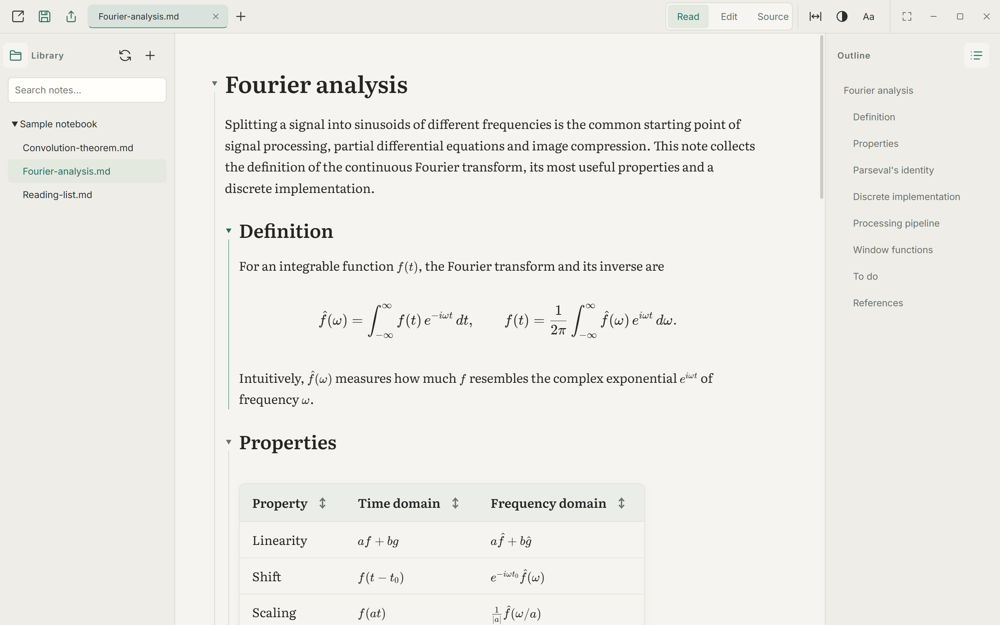
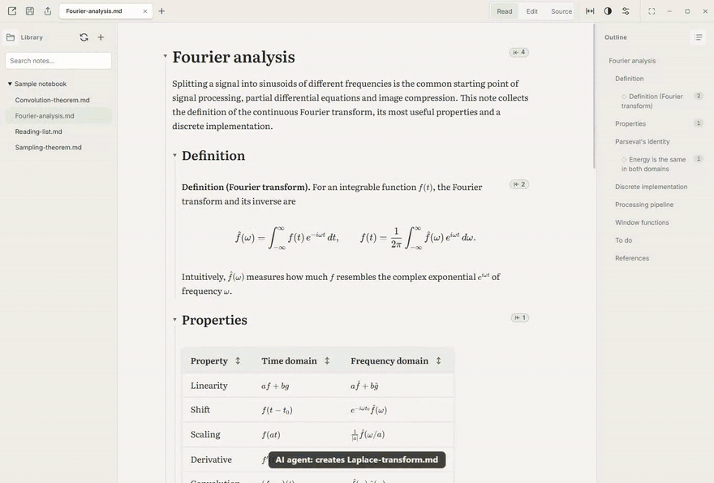
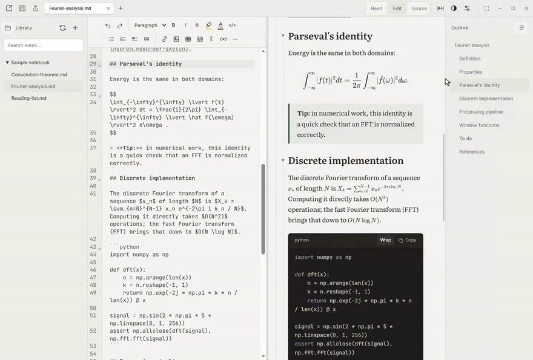
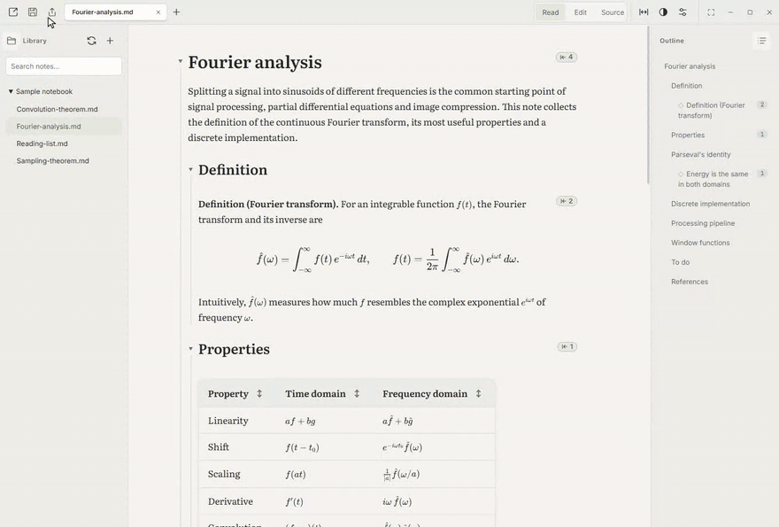
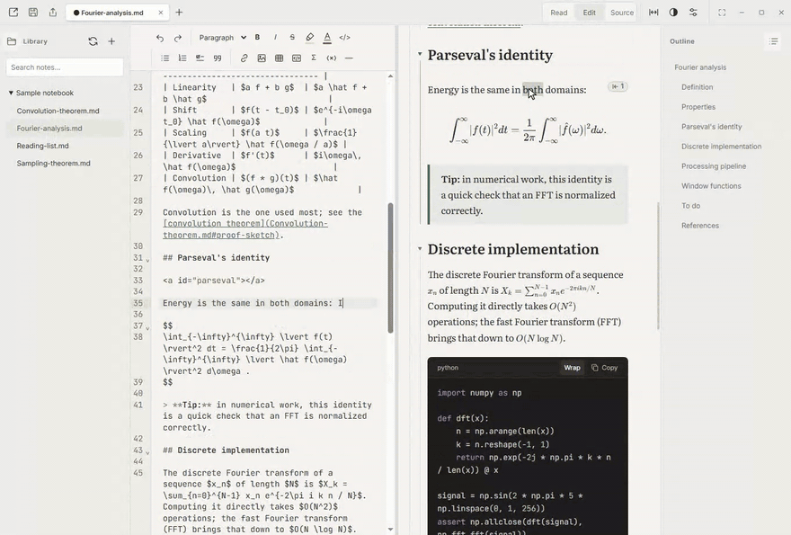
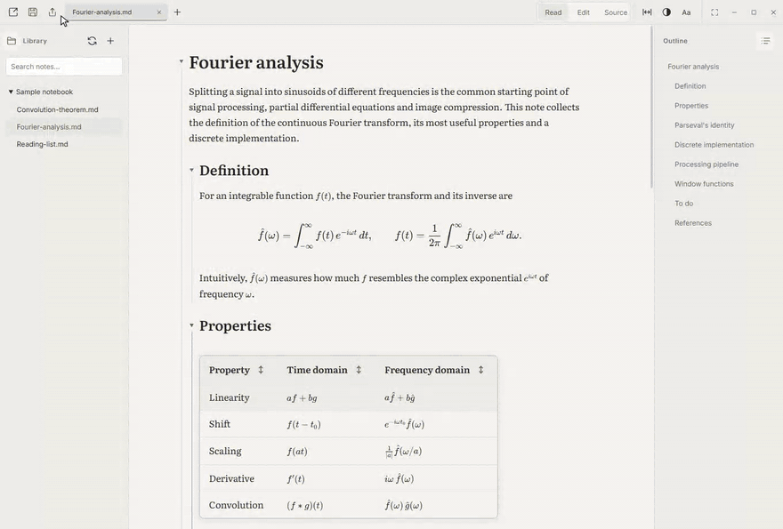
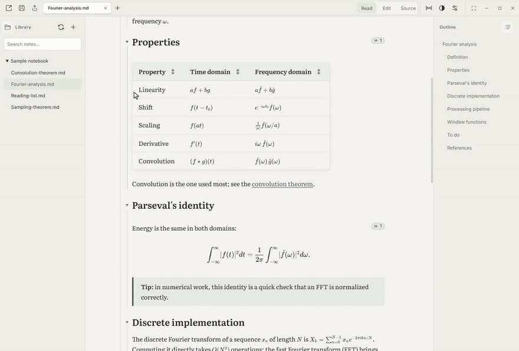
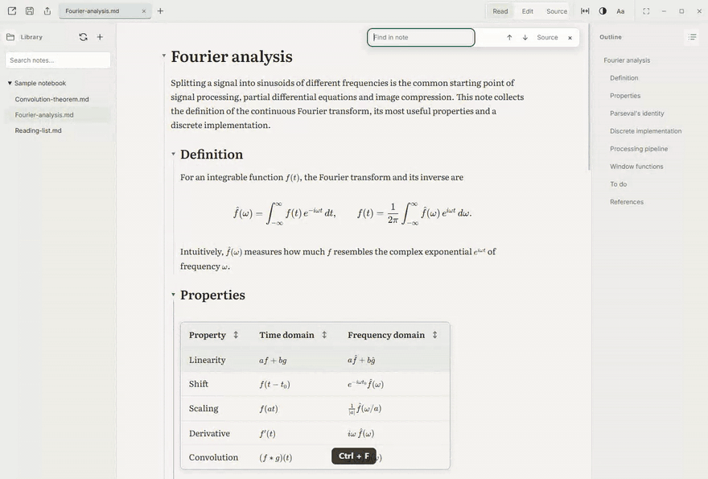
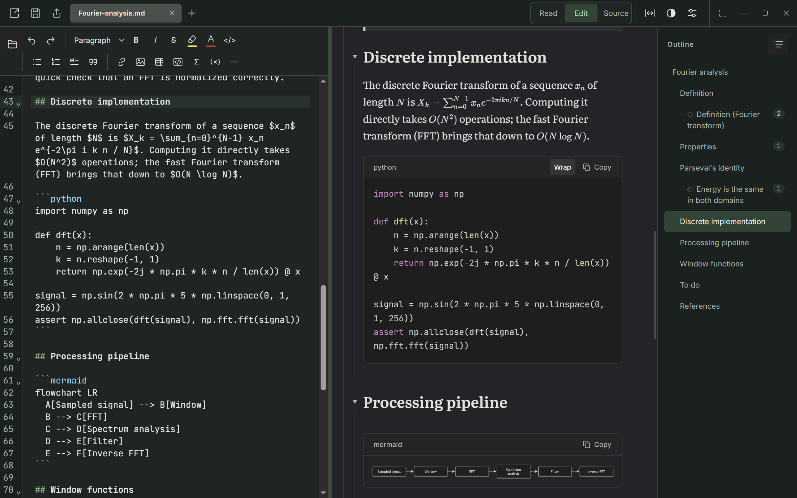

<div align="center">


# Marklore

English · [简体中文](README.zh-CN.md)

**A Markdown knowledge base for Windows: AI drafts your notes, you refine and mark them up. Plain files on your disk, and a reader worth spending hours in.**

[](https://github.com/Zhihua-Lee/marklore/actions/workflows/ci.yml)
[](https://github.com/Zhihua-Lee/marklore/releases/latest)

[](LICENSE)

[Why Marklore](#why-marklore) · [With an AI agent](#working-with-an-ai-agent) · [Features](#features) · [Install](#install) · [Getting started](#getting-started) · [User guide (Chinese)](docs/user-guide.md)

</div>



## Why Marklore

More and more notes start as an AI draft. That is where the work begins: you check the draft, rewrite it and mark it up until it is yours. Marklore is built for that loop.

**Your notes are the database.** A knowledge base in Marklore is a folder of ordinary `.md` files. Nothing is imported, there is no vault format, and Marklore keeps nothing of its own in your folders: drafts, backups and settings stay in your user profile. Git, a sync folder, any text editor, a script and any AI agent all work on the same files.

**AI drafts, you refine.** Let Claude Code, Codex or any agent that edits files write first drafts and reorganize notes in the folder. Marklore shows each change as it lands: an open note re-renders within a fraction of a second, and new notes appear in the library. Then the note is yours to correct, in the editor or right in the rendered preview. The agent never overwrites your unsaved edits; Marklore shows a conflict instead.

**Mark it up like a notebook.** Select text on the rendered page and highlight it, color it or make it bold, as you would in OneNote. Turn this on for Read mode too, if you like, in `Settings → Annotation`; it is off by default, so reading stays undisturbed. The marks are saved in the Markdown file itself, as standard inline HTML, so they travel with the note.

**Reading comes first.** Most Markdown tools are editors with a preview pane. Marklore is a reader that you can also edit in:

- typeset formulas, diagrams and sortable tables;
- an outline that glides to each section;
- link previews, so a reference never costs you your place;
- typography tuned for long sessions, and optional smooth scrolling.

**Links are how knowledge connects.** Relative links and heading anchors are ordinary Markdown, so they work in any viewer and any agent can write them. Marklore makes them navigable both ways: hover to preview, click to open, and `Alt+←` to return to the exact spot. A link you write once is also seen from the other end: a small count beside a section or definition shows which notes cite it, and in what sentence.

**Local and quiet.** No account, no cloud, no telemetry, and no network requests from your notes. Remote images are not loaded.

## Working with an AI agent



1. Open your knowledge-base folder in Marklore (**Open folder**).
2. Run your agent in the same folder, for example `claude` in a terminal there, and ask it to write, split, link or tidy notes.
3. Read and refine: new files appear in the library, and open notes re-render as they change. Rewrite, correct and highlight by hand whenever you like; nothing is saved until you press `Ctrl+S`.

To keep what the agent writes rendering correctly, you can put a few conventions in the folder's `AGENTS.md` or `CLAUDE.md`:

```markdown
Notes here are plain Markdown, read in Marklore.

- One topic per file. Link related notes with relative links, including
  heading anchors: [Parseval's identity](Fourier-analysis.md#parsevals-identity).
- Give definitions and theorems an anchor others can link to: a line
  `<a id="erm"></a>` above a paragraph that starts `**Definition (ERM).**`.
- Inline math in `$…$`. Display math in `$$` blocks, each `$$` on its own line.
- Tables, fenced code and fenced `mermaid` diagrams render as usual.
- Images go in an `assets` folder next to the note.
```

## Features

### Highlight and color, right on the page

Select text on the rendered page and a small format bar appears: bold, italic, strikethrough, highlight, text color, link and inline code. It is always there in Edit mode's preview; turn on `Settings → Annotation → Format bar in Read mode` to mark up while reading, where double-clicking a word selects it and `Alt`+double-click opens its source. The highlight and color buttons apply your last color; right-click either for the palette.



### Who links here, right where it is linked

Beside each section, definition or theorem that other notes link to, a small count shows how often. Hover it to see the citing notes, their section and the sentence with the link; click one to jump there, and `Alt+←` to come back. Links in the note that lead nowhere get a dashed underline.

Definitions and theorems marked with an anchor (`<a id="erm"></a>` above a bold lead such as **Definition (ERM).**) are listed in the outline under their section, with their counts, once something links to them. `Settings → Layout & sidebars → Anchors in the outline` can list every anchor instead, or none.

Linking without typing paths:

- **Copy link to here:** right-click a heading, definition or paragraph (or a note in the library, for the whole note). A paragraph without an anchor gets one, named after its bold lead (you can change it). Paste the link into another note and Marklore makes the path relative to that note.
- **Pick a target:** in a link field (`Ctrl+K`, or Link in the format bar), type part of a note's name; choosing it lists its headings and anchors.

Both write ordinary Markdown links and `<a id>` anchors, which other Markdown tools read too.



### Live preview while you edit

In Edit mode the source is on the left and the preview on the right; formulas, tables and code render while you type. You can also edit a single block right in the preview. Double-clicking text in the reading view jumps to its source.



### Long documents: outline jumps glide

Click an outline entry and the note scrolls smoothly to the heading. Mouse side buttons or `Alt+←` / `Alt+→` go back and forth through the jump history.



### Link previews: read without leaving your place

Hover a link to a local note to read the target in a popup, where you can scroll, select and copy. Click to open it, and `Alt+←` brings you back.



### Find in the rendered note

`Ctrl+F` highlights every match in the rendered text, and `Enter` steps through them. In the editor, `Ctrl+F` opens a compact find bar with match case, whole word, regular expressions and replace.



### More

| Capability                 | Details                                                                                                                                                                         |
| -------------------------- | ------------------------------------------------------------------------------------------------------------------------------------------------------------------------------- |
| Math and technical writing | KaTeX formulas, Mermaid diagrams, syntax highlighting, sortable tables, clickable task lists and footnotes.                                                                     |
| Copy as Markdown           | Copying from the reading view gives the matching Markdown: formulas as `$…$`, links with their targets. `Ctrl+Shift+C` copies the rendered result.                              |
| Multi-document workspace   | Draggable tabs and colored groups; a folder library that follows the disk, with a filter that searches subfolders; recent files on the start page and in the taskbar jump list. |
| Reading appearance         | Light and dark themes, bundled fonts, text size and weight, table styles, adjustable sidebars, full screen. Optional smooth scrolling for touchpad, wheel and scrollbar.        |
| Safe saving and export     | Explicit saves, disk version checks, backups and draft recovery; export to PDF or a standalone offline HTML file.                                                               |
| Portable and bilingual     | Portable mode keeps everything in a `data` folder beside the program; English and Chinese interface.                                                                            |



## Install

Marklore is portable and needs no administrator rights.

1. Download `Marklore-vX.Y.Z-win-x64.zip` from the [latest release](https://github.com/Zhihua-Lee/marklore/releases/latest).
2. (Optional) Verify the download against the matching line in `SHA256SUMS-vX.Y.Z.txt` on the same page:
   ```powershell
   Get-FileHash .\Marklore-vX.Y.Z-win-x64.zip -Algorithm SHA256
   ```
3. **Extract the whole archive** to any folder, for example `D:\Apps\Marklore`. Keep the DLLs, `resources` and `locales` next to the EXE; do not copy the EXE alone.
4. Run `Marklore.exe`. The build is not code-signed, so on first launch Windows SmartScreen may warn about an unknown publisher: choose **More info → Run anyway**.

Want to try it first? The [sample notebook](docs/sample-notebook-en) has formulas, tables, code, a diagram and linked notes: choose it with **Open folder**.

**Portable mode:** turn on `Settings → Background & system → Portable mode` to keep your tabs, drafts, recent files and settings in a `data` folder next to the program, for example on a USB stick.

**Update:** extract the new version to a new folder and start it from there; your settings and drafts live in your user profile (or in `data` in portable mode), not in the program folder. If you enabled start at login or Markdown file registration, register again from the new version in `Settings → Background & system`. Coming from Folio Notes (before v0.2.0)? Quit it first, including the tray icon: Marklore moves its profile over on the first start.

**Uninstall:** delete the program folder. To also remove settings and recovery data, delete `%APPDATA%\Marklore` (`%APPDATA%\folio-notes` for Folio Notes). It contains drafts in plain text, so do not share it.

## Getting started

Use **Open file** to open Markdown files, or **Open folder** to add a folder to the library; you can also drag Markdown files into the window. `Ctrl+N` creates a note and `Ctrl+S` saves.

| Mode   | Use                                                                                               | Shortcut |
| ------ | ------------------------------------------------------------------------------------------------- | -------- |
| Read   | The rendered note, outline, folding and link previews.                                            | `Ctrl+1` |
| Edit   | Markdown on the left, live preview on the right; you can also edit a single block in the preview. | `Ctrl+2` |
| Source | The full Markdown editor for content and structure.                                               | `Ctrl+3` |

| Action                      | Shortcut                                      |
| --------------------------- | --------------------------------------------- |
| Find / next match           | `Ctrl+F` / `Enter` or `F3`                    |
| Back / forward              | `Alt+←` / `Alt+→` (or the mouse side buttons) |
| Copy as Markdown / rendered | `Ctrl+C` / `Ctrl+Shift+C`                     |
| Text size                   | `Ctrl+wheel` / `Ctrl++` / `Ctrl+-`            |
| Full screen                 | `F11`                                         |

All three modes share one draft, and switching modes or tabs keeps your reading position. The Settings button (the sliders icon) in the toolbar opens fonts, theme, language, sidebars, tables and background settings. The interface follows the system language; switch it in `Settings → Theme & language → Language`. The full [user guide](docs/user-guide.md) is in Chinese for now.

## Data and privacy

**Only an explicit save writes back to your Markdown file.** Before saving, Marklore checks the file on disk and offers to resolve a conflict if another program changed it. Recovery drafts and workspace state are stored on this computer, in plain text, and backups do not expire automatically. Image attachments go into an `assets` folder next to the note; keep it with the note when you move it.

## Compatibility

Marklore is a **Windows desktop preview** (Windows 10 / 11, x64); macOS and Linux builds are not planned yet. Formulas render within KaTeX's supported syntax. The first open of a very long note, or one with many formulas or diagrams, can take noticeable time. The tests run for each version, and their limits, are in [VERIFICATION.md](VERIFICATION.md).

## Run from source

The development baseline is **Windows, Node.js 24 and pnpm 11**. Installing dependencies needs the internet once; the built app then works offline.

```powershell
git clone https://github.com/Zhihua-Lee/marklore.git
cd marklore
pnpm install --frozen-lockfile
pnpm build
pnpm start
```

`pnpm start` launches the desktop app; `pnpm dev` starts only a browser UI demo without native file access. Build, test and packaging details are in the [development guide](docs/development.md). The screenshots and animations in this README are regenerated from the sample notebooks by `node tools/readme-media.mjs`.

## Documentation

| Document                                           | Contents                                                                                                 |
| -------------------------------------------------- | -------------------------------------------------------------------------------------------------------- |
| [User guide](docs/user-guide.md) (Chinese)         | Editing, find, copy, tabs and groups, links, images, export, shortcuts and troubleshooting.              |
| [Development guide](docs/development.md) (Chinese) | Setup, workflow, tests, Windows packaging and source layout.                                             |
| [Verification](VERIFICATION.md)                    | Regression checks, results and their limits for each version.                                            |
| [Sample notebook](docs/sample-notebook-en)         | Notes for trying the features, also used to generate the README media ([Chinese](docs/sample-notebook)). |
| [Contributing](CONTRIBUTING.md)                    | Scope, how to report issues and how to propose changes.                                                  |
| [Third-party notices](THIRD-PARTY-NOTICES.txt)     | Licenses of dependencies and fonts.                                                                      |

## License

The project's own code and documentation are released under the [MIT License](LICENSE). Third-party components, fonts and the Electron / Chromium runtime remain under their own licenses; see the [development guide](docs/development.md) for pre-distribution checks.
