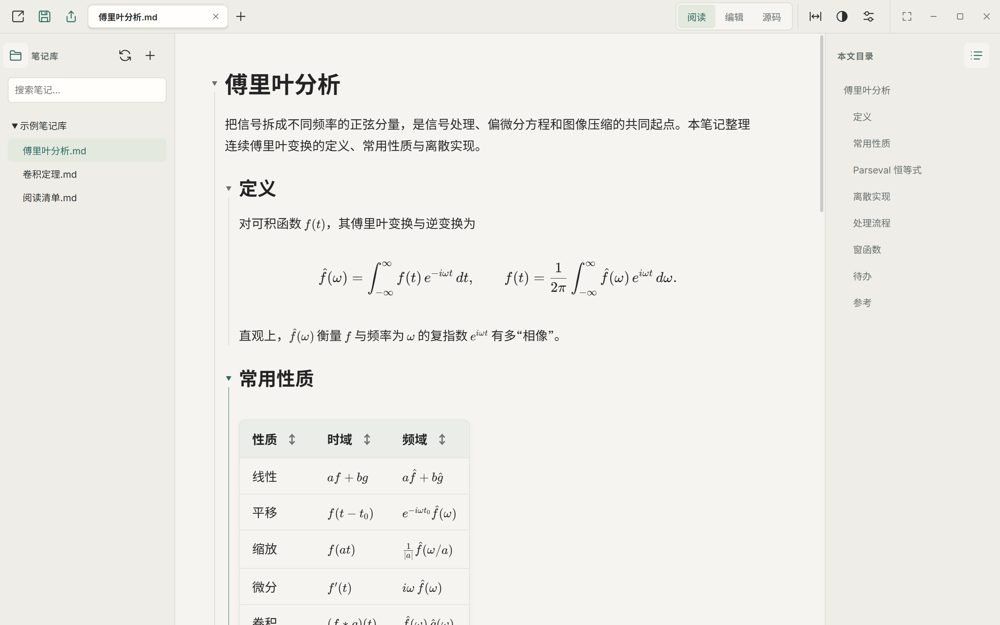
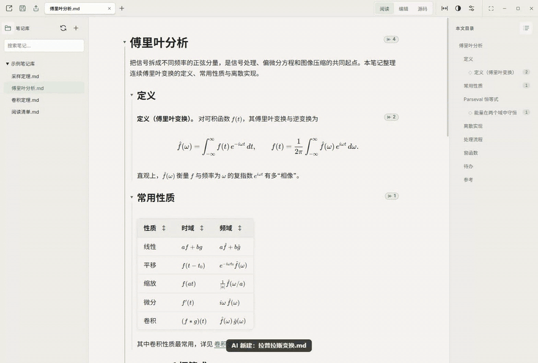
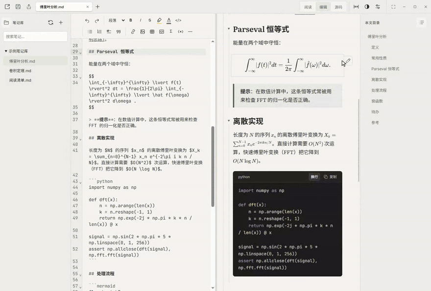
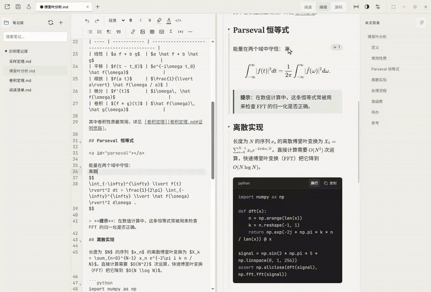
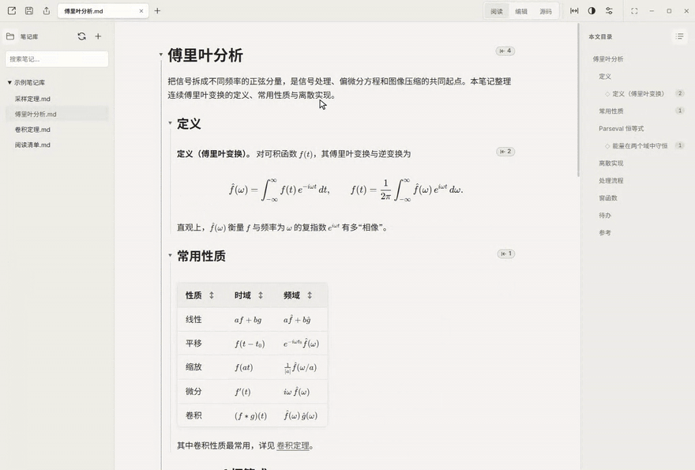
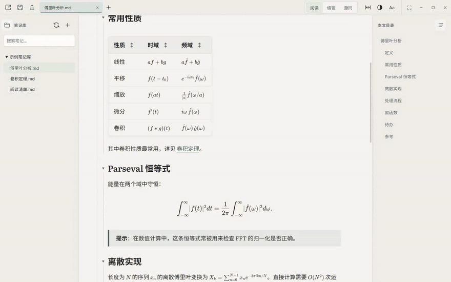
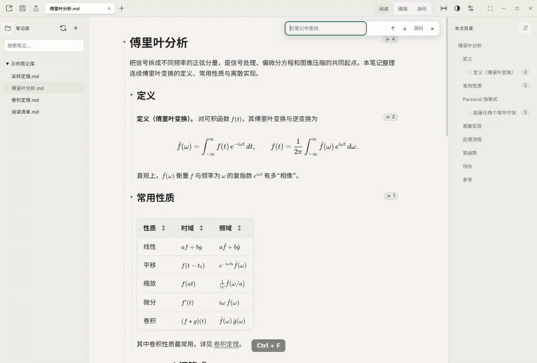
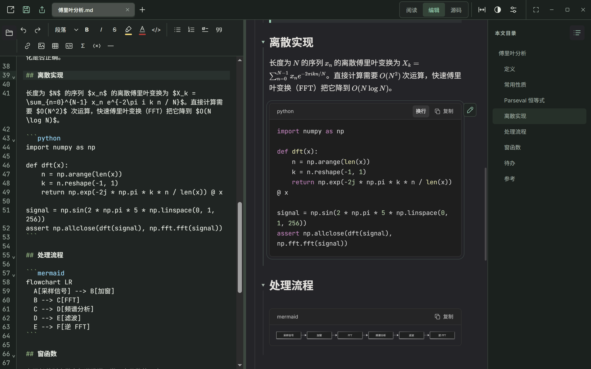

# Marklore

[English](README.md) · 简体中文

**Windows 上的 Markdown 知识库：AI 打初稿，你来细修和批注。笔记是你磁盘上的普通文件，阅读体验值得你长时间停留。**

[](https://github.com/Zhihua-Lee/marklore/actions/workflows/ci.yml)
[](https://github.com/Zhihua-Lee/marklore/releases/latest)

[](LICENSE)

[理念](#为什么是-marklore) · [和 AI 一起用](#和-ai-一起用) · [功能](#功能一览) · [安装](#安装) · [快速上手](#快速上手) · [使用指南](docs/user-guide.md)



## 为什么是 Marklore

越来越多的笔记从 AI 的初稿开始。但初稿只是起点：你要核对、改写、批注，直到它真正成为你自己的知识。Marklore 就是为这个过程设计的。

**笔记本身就是数据库。** 在 Marklore 里，知识库就是一个装着普通 `.md` 文件的文件夹。不需要导入，没有专属的库格式，Marklore 也不会在你的文件夹里留下自己的文件：草稿、备份和设置都在你的用户目录里。Git、同步盘、任意文本编辑器、脚本和任何 AI 工具，处理的都是同一批文件。

**AI 打初稿，你来细修。** 让 Claude Code、Codex 或任何能修改文件的 AI 在文件夹里写初稿、整理笔记。每次修改落到磁盘，Marklore 都会即时显示：已打开的笔记不到一秒就重新渲染，新笔记一写出来就出现在笔记库里。之后笔记归你修改，在编辑器里改，或直接在渲染好的预览里改都可以。AI 不会覆盖你未保存的修改，Marklore 会提示冲突。

**像笔记本一样批注。** 在渲染好的页面上划选文字，就能像在 OneNote 里一样高亮、标色或加粗。愿意的话，可以在 `设置 → 批注` 中把它也开放到阅读模式；默认关闭，阅读时不受打扰。批注以标准内联 HTML 保存在 Markdown 文件里，跟着笔记走。

**阅读优先。** 大多数 Markdown 工具是带预览窗格的编辑器，Marklore 则是一个也能编辑的阅读器：

- 公式、图表和可排序表格都完整排版；
- 点击目录，页面平滑滑到对应章节；
- 链接悬停即可预览，查阅引用不丢失阅读位置；
- 为长时间阅读调校的排版，以及可选的逐帧平滑滚动。

**用链接把知识连起来。** 相对链接和标题锚点都是标准 Markdown，任何查看器都能用，任何 AI 都能写。Marklore 让它们真正好用：悬停预览，点击打开，`Alt+←` 回到原来的位置。

**本地、安静。** 没有账号，没有云端，没有遥测，笔记不会发出任何网络请求，也不加载远程图片。

## 和 AI 一起用



1. 在 Marklore 中用“打开文件夹”打开你的知识库文件夹。
2. 在同一个文件夹里运行你的 AI 工具（例如在该文件夹的终端里运行 `claude`），让它撰写、拆分、链接或整理笔记。
3. 一边读一边改：新文件会出现在笔记库里，打开的笔记随修改即时重新渲染。你随时可以手动改写、修正和高亮；在按 `Ctrl+S` 之前，什么都不会写回文件。

为了让 AI 写出的内容正确渲染，可以把下面几条约定放进文件夹里的 `AGENTS.md` 或 `CLAUDE.md`：

```markdown
这里的笔记是普通 Markdown，用 Marklore 阅读。

- 一个主题一个文件。用相对链接连接相关笔记，可以带标题锚点：
  [卷积定理](卷积定理.md#定义)。
- 行内公式写在 `$…$` 中；独立公式写成 `$$` 块，每个 `$$` 单独占一行。
- 表格、代码块和 `mermaid` 代码块按常规写法即可渲染。
- 图片放在笔记旁边的 `assets` 文件夹里。
```

## 功能一览

### 在页面上直接高亮、标色

在渲染好的页面上划选文字，会出现浮动格式栏：粗体、斜体、删除线、高亮、文字颜色、链接和行内代码。编辑模式的预览区始终可用；在 `设置 → 批注 → 阅读模式中的格式栏` 中开启后，阅读时也能直接批注，双击选中一个词，`Alt`+双击跳到源码。高亮和文字颜色按钮直接应用上次用过的颜色，右键打开调色板。



### 边写边看：实时预览

编辑模式左侧是源码，右侧是预览：公式、表格和代码随输入即时渲染。也可以直接在预览中编辑单个段落；在阅读视图中双击文字，会跳到对应的源码。



### 长文阅读：目录跳转平滑过渡

点击目录，页面平滑滚动到对应标题；沿途的公式和表格提前排版，滚动过程中不会跳动。鼠标侧键或 `Alt+←` / `Alt+→` 在跳转历史中前进、后退。



### 链接预览：不离开当前位置

鼠标悬停在指向本地笔记的链接上，即可在浮窗中阅读目标内容，并可滚动、选择和复制。点击打开，`Alt+←` 返回。



### 在渲染正文中查找

`Ctrl+F` 在渲染后的正文中高亮所有匹配，`Enter` 逐个跳转。在编辑器中，`Ctrl+F` 打开紧凑的查找栏，支持区分大小写、全字匹配、正则表达式和替换。



### 更多

| 能力            | 说明                                                                                                       |
| --------------- | ---------------------------------------------------------------------------------------------------------- |
| 数学与技术写作  | KaTeX 公式、Mermaid 图表、代码高亮、可排序表格、可勾选任务列表和脚注。                                     |
| 复制为 Markdown | 从阅读视图复制得到对应的 Markdown：公式为 `$…$`，链接带目标地址。`Ctrl+Shift+C` 复制渲染后的结果。         |
| 多文档工作区    | 可拖动的标签与彩色分组；跟随磁盘自动更新的笔记库，筛选时包含子文件夹；开始页与任务栏跳转列表中的最近文件。 |
| 阅读外观        | 浅色与深色主题、内置字体、字号与字重、表格样式、可调侧栏、全屏；触控板、滚轮与滚动条的可选平滑滚动。       |
| 安全保存与导出  | 显式保存、磁盘版本检查、备份与草稿恢复；导出 PDF 或独立的离线 HTML。                                       |
| 便携与双语      | 便携模式把所有数据放在程序旁的 `data` 文件夹；中英文界面。                                                 |



## 安装

Marklore 是便携程序，不需要管理员权限。

1. 从[最新版本](https://github.com/Zhihua-Lee/marklore/releases/latest)下载 `Marklore-vX.Y.Z-win-x64.zip`。
2. （可选）用同一页面上 `SHA256SUMS-vX.Y.Z.txt` 中对应的一行校验下载文件：
   ```powershell
   Get-FileHash .\Marklore-vX.Y.Z-win-x64.zip -Algorithm SHA256
   ```
3. **解压整个压缩包**到任意文件夹，例如 `D:\Apps\Marklore`。DLL、`resources` 和 `locales` 要和 EXE 放在一起，不要只复制 EXE。
4. 运行 `Marklore.exe`。程序没有代码签名，首次运行时 Windows SmartScreen 可能提示“未知发布者”，选择**更多信息 → 仍要运行**。

想先试试？[示例笔记库](docs/sample-notebook)包含公式、表格、代码、图表和互相链接的笔记，用“打开文件夹”选择它即可。

**便携模式**：在 `设置 → 后台与系统 → 便携模式` 中开启后，标签、草稿、最近文件和设置都保存在程序旁的 `data` 文件夹，适合放在 U 盘中随身使用。

**升级**：把新版本解压到新目录并从新目录启动；设置和草稿保存在用户数据目录中（便携模式下在 `data` 文件夹），不随程序目录走。若启用过开机启动或 Markdown 文件关联，请在新版本的 `设置 → 后台与系统` 中重新注册。从 Folio Notes（v0.2.0 之前的名字）升级时，请先完全退出它（包括托盘图标），Marklore 首次启动时会自动迁移数据。

**卸载**：删除程序目录；如需同时清除设置与恢复数据，再删除 `%APPDATA%\Marklore`（Folio Notes 为 `%APPDATA%\folio-notes`）。其中包含明文草稿，请勿公开上传。

## 快速上手

用“打开文件”打开 Markdown 文件，或用“打开文件夹”把文件夹加入笔记库；也可以把 Markdown 文件拖进窗口。`Ctrl+N` 新建笔记，`Ctrl+S` 保存。

| 模式 | 用途                                                | 快捷键   |
| ---- | --------------------------------------------------- | -------- |
| 阅读 | 渲染后的笔记、目录、折叠与链接预览。                | `Ctrl+1` |
| 编辑 | 左侧 Markdown，右侧实时预览；也可在预览中编辑单段。 | `Ctrl+2` |
| 源码 | 完整的 Markdown 编辑器，处理内容与结构。            | `Ctrl+3` |

| 操作                      | 快捷键                            |
| ------------------------- | --------------------------------- |
| 查找／下一处              | `Ctrl+F` / `Enter` 或 `F3`        |
| 后退／前进                | `Alt+←` / `Alt+→`（或鼠标侧键）   |
| 复制为 Markdown／渲染结果 | `Ctrl+C` / `Ctrl+Shift+C`         |
| 字号                      | `Ctrl+滚轮` / `Ctrl++` / `Ctrl+-` |
| 全屏                      | `F11`                             |

三种模式共享同一份草稿，切换模式或标签都会保留阅读位置。工具栏的“设置”按钮（滑杆图标）里可以调整字体、主题、语言、侧栏、表格和后台设置。界面默认跟随系统语言，可在 `设置 → 主题与语言 → 界面语言` 中切换。完整操作与快捷键见[使用指南](docs/user-guide.md)。

## 数据与隐私

**只有显式保存才会写回你的 Markdown 文件。** 保存前，Marklore 会检查磁盘上的文件；如果其他程序改过它，会提示你处理冲突。恢复草稿和工作区状态以明文保存在本机，备份不会自动过期。插入的图片放在笔记旁的 `assets` 文件夹中，移动笔记时请一起移动。

## 兼容性

Marklore 目前是 **Windows 桌面预览版**（Windows 10 / 11，x64），暂不计划 macOS 和 Linux 版本。公式按 KaTeX 支持的语法渲染。第一次打开特别长、或含大量公式与图表的笔记时，可能需要明显的等待。每个版本运行过的测试及其局限见 [VERIFICATION.md](VERIFICATION.md)。

## 从源码运行

开发基线为 **Windows、Node.js 24 和 pnpm 11**。安装依赖时需要联网一次，构建出的程序之后完全离线运行。

```powershell
git clone https://github.com/Zhihua-Lee/marklore.git
cd marklore
pnpm install --frozen-lockfile
pnpm build
pnpm start
```

`pnpm start` 启动桌面程序；`pnpm dev` 只启动没有本地文件访问的浏览器界面演示。构建、测试与打包详见[开发指南](docs/development.md)。本 README 中的截图和动图由 `node tools/readme-media.mjs` 从示例笔记库重新生成。

## 文档

| 文档                                  | 内容                                                                                |
| ------------------------------------- | ----------------------------------------------------------------------------------- |
| [使用指南](docs/user-guide.md)        | 编辑、查找、复制、标签与分组、链接、图片、导出、快捷键与排错。                      |
| [开发指南](docs/development.md)       | 环境、流程、测试、Windows 打包与源码结构。                                          |
| [验证记录](VERIFICATION.md)           | 每个版本的回归检查、结果与局限。                                                    |
| [示例笔记库](docs/sample-notebook)    | 用于试用功能的笔记，也用于生成 README 中的演示（[英文](docs/sample-notebook-en)）。 |
| [参与贡献](CONTRIBUTING.md)           | 项目定位、如何报告问题和提交改动。                                                  |
| [第三方声明](THIRD-PARTY-NOTICES.txt) | 依赖与字体的许可证文本。                                                            |

## 许可证

自有代码与文档采用 [MIT 许可证](LICENSE)。第三方组件、字体及 Electron／Chromium 运行时继续适用各自许可证；分发前的检查事项见[开发指南](docs/development.md#分发前检查)。
